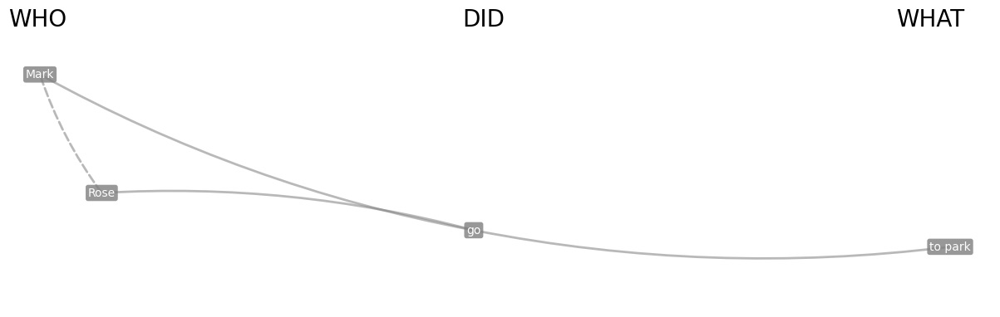

# Who-did-What Networks

<p align="center">
  
</p>

A Python library that implements a novel framework to measure bias through its actors, actions and consequences in English.


## Description
Who-Did-What cognitive networks are a novel framework to measure bias through its actors, actions and consequences. These semantic/syntactic multilayer networks are composed of 3 layers:
- subjects/actors (WHO)
- objects/actions (DID)
- verbs/consequences (WHAT)

Part-of-speech tagging is determined by an AI reading each sentence in a text (spaCy). Inter-layer connections are established with a rule-based approach applied on the syntactic parsing of an AI (spaCy). Intra-layer connections are semantic and established only if two words are synonyms (e.g. father and dad), highlighted in green. Like in textual forma mentis networks (Stella, PeerJ Comp. Sci, 2020), individual concepts are labelled as “positive” (cyan), “negative” (red) and “neutral” (gray) according to Vader Sentiment Analysis. Inter-layer paths indicate “who did what” - i.e. which actions and which consequences were portrayed by specific agents in texts. Whereas tools such through EmoAtlas can give general results about the overall context of biased perceptions, Who-Did-What networks can complement TFMNs by providing a focus on actors, actions and consequences.

This framework only works for the English language.


<p align="center">
  
</p>


### Features

- **SVO Extraction**: Extracts subjects (who), verbs(did), and objects(what) from sentences.
- **Coreference Resolution**: Handles pronouns and other references using either `stanza` or `fastcoref`.
- **Valence Analysis**: Determines the sentiment (positive, negative, neutral) of words using Vader.
- **Graph Visualization**: Visualizes SVO relationships using NetworkX and Matplotlib.
- **Hypergraphs extraction**: handles the exporting of the who-did-what relationships as a pandas dataframe.
- **Semantic enrichment**: Synonyms are included in the SVO extraction and in the visualization.


---
## Installation

Currently, the package can be installed through this Github repository. Note that this requires [Git](https://git-scm.com/) to be installed.

```bash
pip install git+https://github.com/RiccardoImprota/Who-did-What-Networks
```

### Prerequisites

- Python 3.7 or higher
- pip package manager

---
## Usage and guides

For detailed documentation and examples, please refer to the folder 'Docs & Guides' or check out the Google Colab demo.


```python
import whodidwhat as wdw

text = """Mark and Rose go to the park."""

svo = wdw.extract_svos_from_text(text)
display(svo)
```

| Node 1   | WDW   | Node 2   | WDW2   | Hypergraph                                                |   Semantic-Syntactic |   svo_id |
|:---------|:------|:---------|:-------|:----------------------------------------------------------|---------------------:|---------:|
| Mark     | Who   | go       | Did    | [[('Mark', []), ('Rose', [])], ['go'], [('to park', [])]] |                    0 |        0 |
| Rose     | Who   | go       | Did    | [[('Mark', []), ('Rose', [])], ['go'], [('to park', [])]] |                    0 |        0 |
| go       | Did   | to park  | What   | [[('Mark', []), ('Rose', [])], ['go'], [('to park', [])]] |                    0 |        0 |
| Mark     | Who   | Rose     | Who    | [[('Mark', []), ('Rose', [])], ['go'], [('to park', [])]] |                    0 |        0 |


```
wdw.plot_svo_graph(svo)
```
<p align="center">
  
</p>

### Starting Guide

You can access the Starting Guide here: [Starting Guide](https://github.com/RiccardoImprota/Who-did-What-Networks/blob/main/Docs%20%26%20Guides/Starting%20Guide.ipynb)

**Contents of the Starting Guide:**


### Google Colab Demo

You can access the Google Colab demo here: [Who-Did-What Demo](https://colab.research.google.com/drive/1mT9wi6fKXCm3o7765hRhNKyRe--6hBRG?usp=sharing).


---
## References:
- *Stella, M. (2020). Text-mining forma mentis networks reconstruct public perception of the STEM gender gap in social media. PeerJ Computer Science, 6, e295.*
- *Hutto, C., & Gilbert, E. (2014, May). Vader: A parsimonious rule-based model for sentiment analysis of social media text. In Proceedings of the international AAAI conference on web and social media (Vol. 8, No. 1, pp. 216-225).*

## License

This project is licensed under the BSD 3-Clause License.

